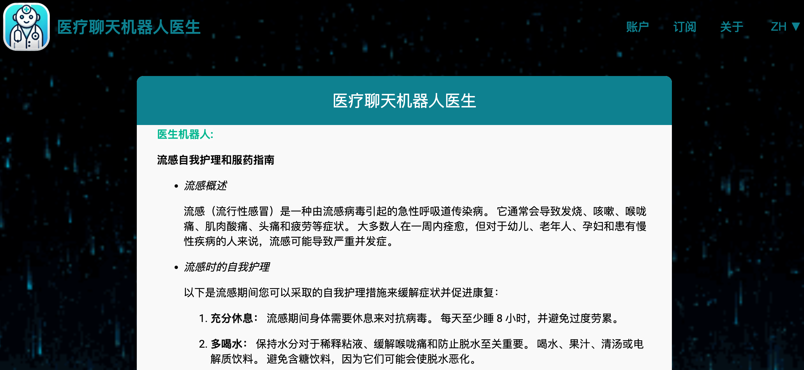
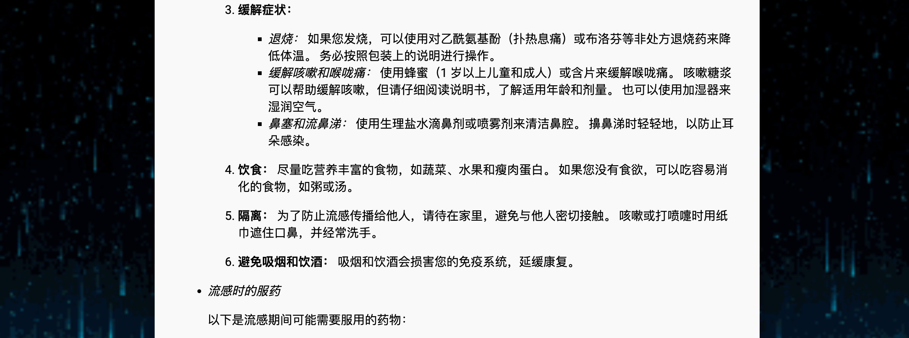
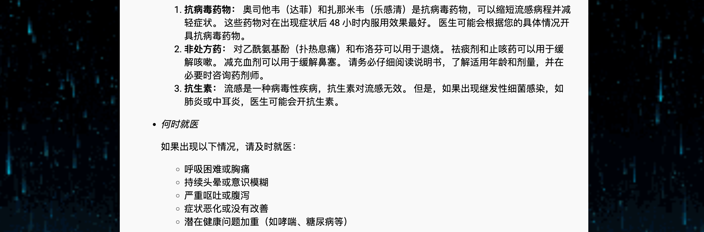
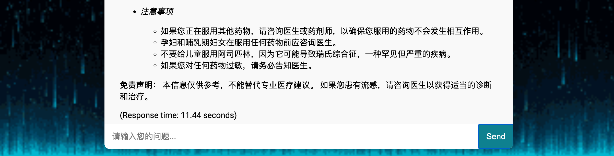

# 基于 AutoGen 的医疗聊天机器人与 RAG 🤖🩺

欢迎来到 **AutoGen-RAG Medical Chatbot** 项目！本项目利用前沿技术，如 **AutoGen**、**检索增强生成（RAG）** 和 **Gemini Flash 2.0 API**，为您提供一个智能医疗聊天机器人。系统使用来自 Hugging Face 的专用医疗数据集（包含超过 **256,916** 个问答对），并采用 FAISS 进行高效相似性搜索。服务器基于 **FastAPI** 构建，并利用 **MarkdownJS** 动态渲染 HTML。

---

## 🚀 入门

### 克隆仓库

使用以下命令将仓库克隆到本地：

```bash
git clone https://github.com/Lelekhoa1812/AutoGen-RAG-Medical-Chatbot.git
```

### 安装

请参阅我们的 [安装指南](https://github.com/Lelekhoa1812/AutoGen-RAG-Medical-Chatbot/blob/main/setup.md) 以了解如何安装和配置该项目。

### Autogen 用法

请查看我们的 [Autogen 文档](https://github.com/Lelekhoa1812/AutoGen-RAG-Medical-Chatbot/blob/main/autogen.md) 以获取更多实际应用示例和创意。

---

## ⚙️ 运行项目

### 启动服务器

使用以下命令运行主服务器脚本：

```bash
python3 main.py
```

### 调试模式

若需调试，请运行：

```bash
python3 -X faulthandler main.py
```

### 启动用户界面 (UI)

将 Vercel 和 Node Module 块安装到您的静态目录并运行：
```bash
vercel run dev
```

### MongoDB 工具

- **连接并列出集合：**  
  ```bash
  python3 connect_mongo.py
  ```
- **清空 MongoDB 数据（重置数据）：**  
  ```bash
  python3 clear_mongo.py
  ```
- **MongoDB 数据迁移：**  
  ```bash
  python3 migrate.py
  ```

---

## 💡 主要功能

- **先进的 RAG 集成：** 将相关医疗问答对的检索与生成式回答结合起来。
- **专业医疗数据集：** 使用包含超过 **256,916** 个问答对的专用数据集。
- **现代化 API 支持：** 由 Gemini Flash 2.0 API 提供支持，生成动态且精确的医疗回答。
- **高性能 FAISS 索引：** 利用 FAISS（支持 IVFPQ 压缩）实现快速且可扩展的相似性搜索。
- **强大的 FastAPI 后端：** 构建了一个可扩展、高效的 FastAPI 服务器。
- **动态 Markdown 前端：** 前端使用动态 HTML 模板，通过 MarkdownJS 渲染富文本回答。
- **多语言支持：** 包括英语、越南语和中文，服务于全球用户。

---

## 📸 截图

### 聊天机器人控制台示例


### 界面





### 界面（含加载动画）


---

## 🔧 自定义

- **界面定制：**  
  编辑 `static` 目录下的 HTML/CSS 模板以匹配您的品牌和设计风格。
- **语言设置：**  
  在 JavaScript 部分更新语言翻译，修改或添加新语言。
- **API 集成：**  
  根据您的需求定制 Gemini Flash API 的集成方式。

---

## 📚 文档

有关详细的安装说明和更多文档，请参阅：  
- [安装指南](https://github.com/Lelekhoa1812/AutoGen-RAG-Medical-Chatbot/blob/main/setup.md)  
- [Autogen 文档](https://github.com/Lelekhoa1812/AutoGen-RAG-Medical-Chatbot/blob/main/autogen.md)  
- [项目 Wiki](https://github.com/Lelekhoa1812/AutoGen-RAG-Medical-Chatbot/wiki)

---

## 📝 许可证

本项目基于 [Apache 2.0 许可证](https://github.com/Lelekhoa1812/AutoGen-RAG-Medical-Chatbot/blob/main/LICENSE) 发布。

---

欢迎您对本项目提出建议或贡献代码。如有任何问题或建议，请随时提交 issue。祝您编码愉快！ 😊

---

作者: 黎登科     
最新的更新: 04/03/2025

---