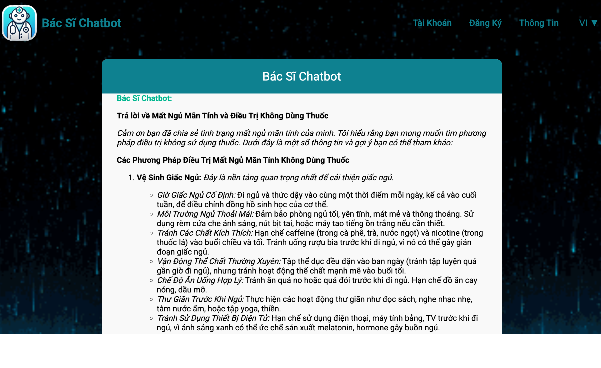
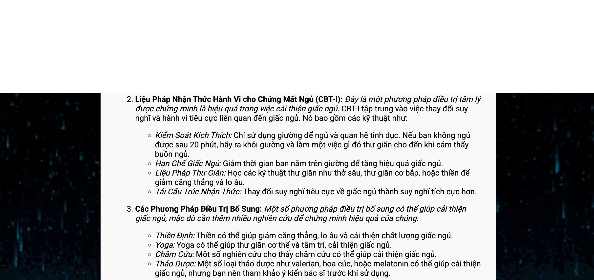
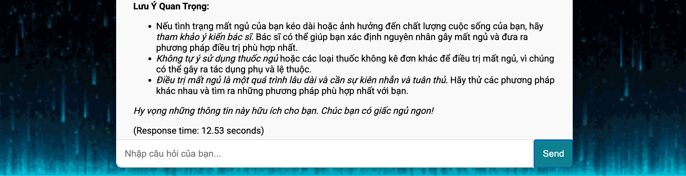
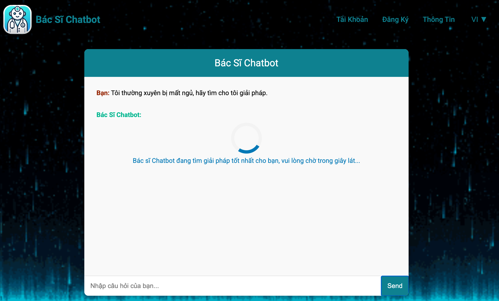

# Chatbot Y Tế Dựa trên AutoGen với RAG 🤖🩺

Chào mừng bạn đến với dự án **AutoGen-RAG Medical Chatbot**! Dự án này sử dụng các công nghệ tiên tiến như **AutoGen**, **Retrieval-Augmented Generation (RAG)** và **Gemini Flash 2.0 API** để cung cấp một chatbot y tế thông minh. Hệ thống sử dụng một bộ dữ liệu y tế đặc thù từ Hugging Face (với hơn **256.916 cặp QA**) và áp dụng FAISS để tìm kiếm tương đồng một cách hiệu quả. Máy chủ được xây dựng trên **FastAPI** và render HTML động bằng **MarkdownJS**.

---

## 🚀 Bắt đầu

### Clone kho lưu trữ

Clone kho lưu trữ về máy của bạn với lệnh:

```bash
git clone https://github.com/Lelekhoa1812/AutoGen-RAG-Medical-Chatbot.git
```

### Cài đặt

Vui lòng tham khảo [Hướng Dẫn Cài Đặt](https://github.com/Lelekhoa1812/AutoGen-RAG-Medical-Chatbot/blob/main/setup.md) để biết cách cài đặt và cấu hình dự án.

### Sử dụng Autogen

Khám phá các ví dụ thực tế và ý tưởng sử dụng tại [Tài Liệu Autogen](https://github.com/Lelekhoa1812/AutoGen-RAG-Medical-Chatbot/blob/main/autogen.md).

---

## ⚙️ Chạy Dự Án

### Khởi động máy chủ

Chạy script chính với lệnh:

```bash
python3 app.py
```

### Chế độ Debug

Để chạy chế độ debug, sử dụng:

```bash
python3 -X faulthandler app.py
```

### Chạy giao diện (UI)

Cài Vercel và Node Modules tới tệp static và chạy:
```bash
vercel run dev
```

### 🗄️ Các tiện ích MongoDB

- **Kết nối và liệt kê các Collection:**  
  ```bash
  python3 connect_mongo.py
  ```
- **Xoá dữ liệu MongoDB (Reset Data):**  
  ```bash
  python3 clear_mongo.py
  ```
- **Di chuyển dữ liệu MongoDB:**  
  ```bash
  python3 migrate.py
  ```

---

## 💡 Tính Năng

- **Tích hợp RAG tiên tiến:** Kết hợp việc truy xuất cặp QA y tế liên quan với khả năng tạo câu trả lời dựa trên nội dung.
- **Bộ dữ liệu y tế chuyên sâu:** Sử dụng bộ dữ liệu chuyên ngành với hơn **256.916 cặp QA**.
- **API hiện đại:** Được hỗ trợ bởi Gemini Flash 2.0 API để tạo ra câu trả lời y tế chính xác và năng động.
- **Chỉ số FAISS hiệu năng cao:** Sử dụng FAISS (với nén IVFPQ) để tìm kiếm tương đồng nhanh chóng và mở rộng.
- **Backend mạnh mẽ với FastAPI:** Cung cấp máy chủ mở rộng, hiệu quả được xây dựng trên FastAPI.
- **Giao diện người dùng động với Markdown:** Frontend sử dụng template HTML động được cải thiện bởi MarkdownJS cho các câu trả lời dạng rich text.
- **Hỗ trợ đa ngôn ngữ:** Bao gồm các lựa chọn ngôn ngữ như Tiếng Anh, Tiếng Việt và Tiếng Trung, phục vụ đối tượng toàn cầu.

---

## ⚙️ Deployment Setup

|  **Component** | **Hosting Service**  |                   **URL**                         |
|----------------|----------------------|---------------------------------------------------|
|  **Backend**   | Hugging Face Spaces  | `https://binkhoale1812-medical-chatbot.hf.space/` |
|  **Frontend**  | Vercel               | `https://medical-chatbot.vercel.app`              |
|  **Database**  | MongoDB Atlas        |           2 DBs                                   |

---

## 📸 Hình Ảnh

### Ví dụ về giao diện Chatbot


### Giao diện và câu trả lời




### Giao diện với hiệu ứng loader


---

## 🔧 Tùy Chỉnh

- **Tùy chỉnh giao diện:** Chỉnh sửa các template HTML/CSS trong thư mục `static` để phù hợp với thương hiệu và phong cách của bạn.
- **Cài đặt ngôn ngữ:** Cập nhật các bản dịch ngôn ngữ trong phần JavaScript để thay đổi hoặc thêm ngôn ngữ mới.
- **Tích hợp API:** Tùy chỉnh tích hợp Gemini Flash API theo nhu cầu sử dụng của bạn.

---

## 📚 Tài Liệu

Để biết hướng dẫn chi tiết và tài liệu bổ sung, hãy tham khảo:  
- [Hướng Dẫn Cài Đặt](https://github.com/Lelekhoa1812/AutoGen-RAG-Medical-Chatbot/blob/main/setup.md)  
- [Tài Liệu Autogen](https://github.com/Lelekhoa1812/AutoGen-RAG-Medical-Chatbot/blob/main/autogen.md)  
- [Wiki Dự Án](https://github.com/Lelekhoa1812/AutoGen-RAG-Medical-Chatbot/wiki)

---

## 📝 Giấy Phép

Dự án này được cấp phép theo [Apache 2.0 License](https://github.com/Lelekhoa1812/AutoGen-RAG-Medical-Chatbot/blob/main/LICENSE).

---

Nếu bạn có bất kỳ câu hỏi hay đề xuất nào, vui lòng đóng góp hoặc mở issue. Chúc bạn mã hóa vui vẻ! 😊

---

Author: Lê Đăng Khoa   
Latest Update: 04/03/2025

---