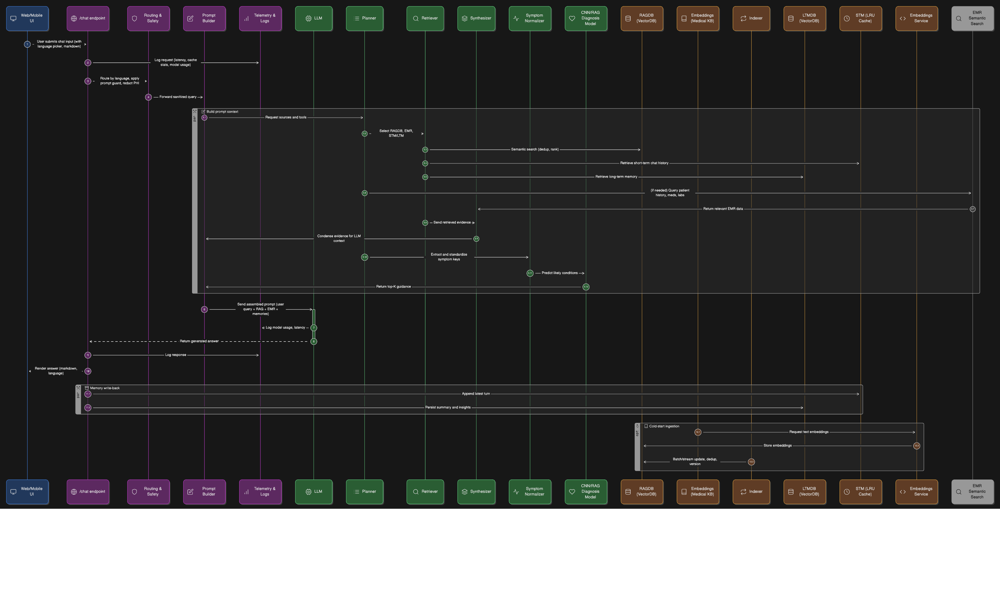

# Medical Chatbot with RAG 🤖🩺

Welcome to the RAG-based Medical Chatbot project! This project leverages cutting‑edge technologies such as Retrieval-Augmented Generation (RAG), Gemini Flash 2.5 (Backbone reasoning LLM), and MedGemma (VLM) to deliver an intelligent medical chatbot. It uses a custom medical dataset (over 256,916 QA scenarios), diagnosis retrieval agent (over 4,962 symptom scenarios), and employs FAISS for efficient similarity search. The server runs on FastAPI and dynamically renders HTML using MarkdownJS.

1. **Backend**:  
   “FastAPI backend is hosted on Hugging Face API inference with Cross-Origin Resource Sharing (CORS) configured to allow local and production development. Fusing LLM (Gemini 2.5), VLM (MedGemma), NLPs, RAG (FAISS).”

2. **Frontend**:  
   “Frontend (UI), built with Node.js and incorporating Vite, Axios, and http-server, is deployed on Vercel.”

---
For my Vietnamese language user, navigate to [README](https://github.com/Lelekhoa1812/AutoGen-RAG-Medical-Chatbot/blob/main/README-vi.md)

For my Mandarin/Chinese language user, navigate to [README](https://github.com/Lelekhoa1812/AutoGen-RAG-Medical-Chatbot/blob/main/%08README-zh.md)

---

# 🔗 Access Now: 
[Medical Chatbot 📱](https://medical-chatbot-henna.vercel.app/)     
[Hugging Face Space 🤗](https://huggingface.co/spaces/BinKhoaLe1812/Medical-Chatbot/tree/main)     
<!-- [Streamlit Backend 🤖](https://medical-chatbot-henna.streamlit.app/) -->

---

## 🚀 Getting Started

### Clone the Repository

Clone the repository to your local machine with:

```bash
git clone https://github.com/Lelekhoa1812/AutoGen-RAG-Medical-Chatbot.git
```

### Installation

Follow the detailed installation instructions in our [Setup Guide](https://github.com/Lelekhoa1812/AutoGen-RAG-Medical-Chatbot/blob/main/setup.md) to install and configure the project.

---

## ⚙️ Running the Project

### Start the Server

Run the main server script with:

```bash
python3 app.py
```

### Debug Mode

For debugging purposes, run:

```bash
python3 -X faulthandler app.py
```

### Start the Interface (UI)

Install Vercel and Node Modules to your static directory and run:
```bash
vercel run dev
```

### 🗄️ MongoDB Utilities

- **Connect and List Collections:**  
  ```bash
  python3 connect_mongo.py
  ```
- **Clear MongoDB Data (Data Reset):**  
  ```bash
  python3 clear_mongo.py
  ```
- **MongoDB Data Migration:**  
  ```bash
  python3 migrate.py
  ```

---

## 💡 Features
- **LLM and VLM:** Dynamic fusing of Reasoning LLM model backbone (Gemini 2.5 Pro) and VLM image diagnosis (MedGemma from Gemma3 model family).
- **Advanced RAG Integration:** Combines retrieval of relevant medical QA pairs with generative response formulation.
- **Smart Short-Term Memory (STM):** Uses in-memory FAISS per-user with top-k relevant chunking, caching on session's LRU.
- **Gemini-Powered Chunking:** Uses Gemini Flash 2.5 Lite for translating, summarising, and context-aware chunk splitting of chatbot responses.
- **Context Decay & Prioritization:** Recent and frequently referenced medical topics are prioritized during chunk search.
- **Deduplication & Caching:** Avoids embedding or storing repeated data; maximizes memory efficiency.
- **Custom Medical Dataset:** Utilizes a specialized dataset with over 256,916 QA entries.
- **Symptom to Diagnosis:** Smart similarity retrieval of prognosis from list of available symptoms, 4.9k scenario-diagnosis was used.
- **High-Performance Indexing:** Employs FAISS (cosine similarity) for fast, scalable similarity search.
- **Robust FastAPI Backend:** Provides a scalable, efficient server built on FastAPI.
- **Dynamic UI with Markdown Rendering:** The frontend uses dynamic HTML templates enhanced by MarkdownJS for rich text responses.
- **Chat-history continuity:** Sytem dynamically fusing semantic search over historical QA and recent chat sessions with SLM verifier to ensure converstational continuity. [READ MORE](https://github.com/Lelekhoa1812/AutoGen-RAG-Medical-Chatbot/blob/main/Medical-Chatbot/chat-history.md).
- **Multilingual Support:** Includes English, Vietnamese, and Mandarin language options for a global audience. Leveraging NLP lightweight models like `envit5-translation` and `opus-mt-zh-en`.

---

## 📸 Screenshots

### Chatbot Console Example


### Chatbot with Answer:


---

## 📊 Memory Management

* Each user has their own LRU-based short-term memory.
* Maximum **10 Q\&A turns per user**.
* **Gemini-chunked responses** are split by topic ("Topic: <...>") and summarised.
* **FAISS stores up to 30 recent chunks** per user for fast nearest-neighbor search.
* **Cosine similarity threshold** ensures only relevant topics are injected into the LLM prompt.
* Chunks include:

  ```json
  {
    "tag": "headache meds",
    "text": "Use paracetamol...",
    "vec": [embedding_vector],
    "used": 3,
    "timestamp": 1720287547.123
  }
  ```
* **Rebuilds FAISS** automatically without re-embedding.
* **Retry logic (5x)** ensures Gemini chunking robustness.
* Uses **time-decay scoring** to prioritize recent and reused content.

---

### 🧠 Knowledge Embedding & Retrieval

* **SentenceTransformer Embedding** (`all-MiniLM-L6-v2`) is used for encoding both user queries and knowledge base entries.
* **Symptom Diagnosis Loader**: Converts 1-hot encoded symptom data from `symbipredict_2022.csv` into natural language Q\&A pairs.
* **MongoDB Vector Cache**: All records are embedded and saved with `_id`, symptom list, diagnosis label, and vector.
* **Similarity Retrieval**: Uses cosine similarity (via FAISS or numpy dot product) to find top-k relevant symptom-based diagnoses.
* **Strict Thresholds**: Minimum semantic similarity enforced for diagnosis retrieval (≥ 0.35).
* **Multi-source Support**: Both general QA (`qa_data`) and symptom diagnosis (`symptom_diagnosis`) collections are queried contextually.

---

## 🔧 Customization

- **UI Customization:**  
  Edit the HTML/CSS templates in the `static` directory to match your branding and design preferences.
- **Language Settings:**  
  Update the language translations in the JavaScript section to modify or add new languages.
- **API Integration:**  
  Customize the Gemini Flash API integration as needed for your use case.

---

## ⚙️ Deployment Setup

|  **Component** | **Hosting Service**  |                   **URL**                         |
|----------------|----------------------|---------------------------------------------------|
|  **Backend**   | Hugging Face Spaces  | `https://binkhoale1812-medical-chatbot.hf.space/` |
|  **Frontend**  | Vercel               | `https://medical-chatbot.vercel.app`              |
|  **Database**  | MongoDB Atlas        |           2 DBs                                   |

---

## 📚 Documentation

For more detailed instructions and further documentation, please refer to:  
- [Setup Guide](https://github.com/Lelekhoa1812/AutoGen-RAG-Medical-Chatbot/blob/main/setup.md)  
- [Autogen Documentation](https://github.com/Lelekhoa1812/AutoGen-RAG-Medical-Chatbot/blob/main/autogen.md)  
- [Project Wiki](https://github.com/Lelekhoa1812/AutoGen-RAG-Medical-Chatbot/wiki)

---

## 🧩 Flowchart



---

## 📝 License

This project is licensed under the [Apache 2.0 License](https://github.com/Lelekhoa1812/AutoGen-RAG-Medical-Chatbot/blob/main/LICENSE).

---

Feel free to contribute or raise issues if you have any questions or suggestions. Happy coding! 😊

---

Author: (Liam) Dang Khoa Le    
Latest Update: 06/07/2025

---
