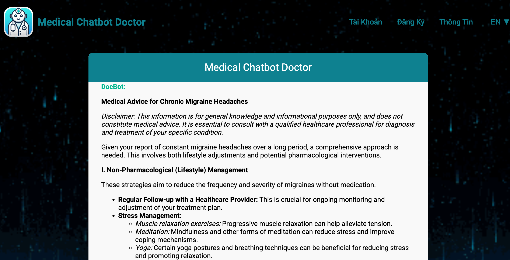
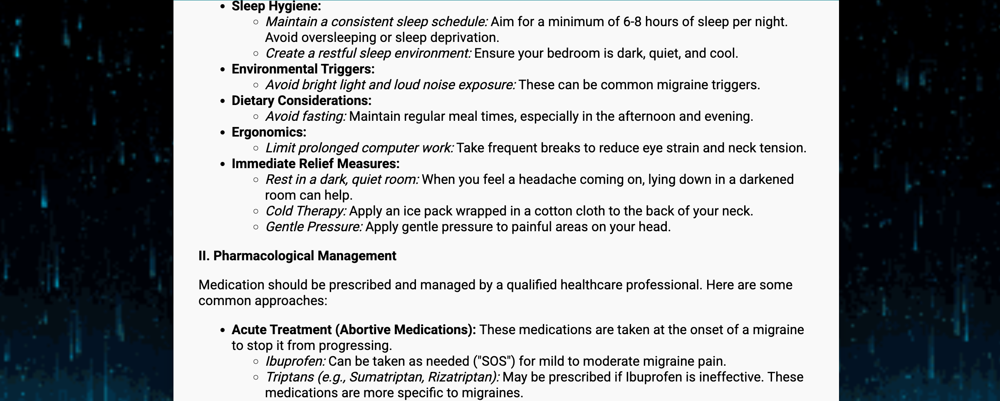
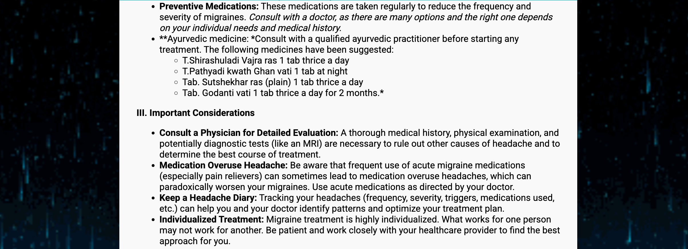

# AutoGen-Based Medical Chatbot with RAG 🤖🩺

Welcome to the **AutoGen-RAG Medical Chatbot** project! This project leverages cutting‑edge technologies such as **AutoGen**, **Retrieval-Augmented Generation (RAG)**, and the **Gemini Flash 2.0 API** to deliver an intelligent medical chatbot. It uses a custom medical dataset from Hugging Face (with over 256,916 QA entries) and employs FAISS for efficient similarity search. The server runs on **FastAPI** and dynamically renders HTML using **MarkdownJS**.

1. **Backend**:  
   “FastAPI backend is hosted on Hugging Face API inference (Render and Streamlit as alternative options) with Cross-Origin Resource Sharing (CORS) configured to allow local and production development.”

2. **Frontend**:  
   “Frontend (UI), built with Node.js and incorporating Vite, Axios, and http-server, is deployed on Vercel.”

---
For my Vietnamese language user, navigate to [README](https://github.com/Lelekhoa1812/AutoGen-RAG-Medical-Chatbot/blob/main/README-vi.md)

For my Mandarin/Chinese language user, navigate to [README](https://github.com/Lelekhoa1812/AutoGen-RAG-Medical-Chatbot/blob/main/%08README-zh.md)

---

# 🔗 Access Now: 
[Medical Chatbot 📱](https://medical-chatbot-henna.vercel.app/)     
[Hugging Face Space 🤗](https://huggingface.co/spaces/BinKhoaLe1812/Medical-Chatbot/tree/main)     
<!-- [Streamlit Backend 🤖](https://medical-chatbot-henna.streamlit.app/) -->

---

## 🚀 Getting Started

### Clone the Repository

Clone the repository to your local machine with:

```bash
git clone https://github.com/Lelekhoa1812/AutoGen-RAG-Medical-Chatbot.git
```

### Installation

Follow the detailed installation instructions in our [Setup Guide](https://github.com/Lelekhoa1812/AutoGen-RAG-Medical-Chatbot/blob/main/setup.md) to install and configure the project.

---

## ⚙️ Running the Project

### Start the Server

Run the main server script with:

```bash
python3 app.py
```

### Debug Mode

For debugging purposes, run:

```bash
python3 -X faulthandler app.py
```

### Start the Interface (UI)

Install Vercel and Node Modules to your static directory and run:
```bash
vercel run dev
```

### 🗄️ MongoDB Utilities

- **Connect and List Collections:**  
  ```bash
  python3 connect_mongo.py
  ```
- **Clear MongoDB Data (Data Reset):**  
  ```bash
  python3 clear_mongo.py
  ```
- **MongoDB Data Migration:**  
  ```bash
  python3 migrate.py
  ```

---

## 💡 Features

- **Advanced RAG Integration:** Combines retrieval of relevant medical QA pairs with generative response formulation.
- **Custom Medical Dataset:** Utilizes a specialized dataset with over **256,916 QA entries**.
- **State-of-the-Art API:** Powered by Gemini Flash 2.0 API for dynamic and precise medical responses.
- **High-Performance Indexing:** Employs FAISS (with IVFPQ compression) for fast, scalable similarity search.
- **Robust FastAPI Backend:** Provides a scalable, efficient server built on FastAPI.
- **Dynamic UI with Markdown Rendering:** The frontend uses dynamic HTML templates enhanced by MarkdownJS for rich text responses.
- **Multilingual Support:** Includes English, Vietnamese, and Mandarin language options for a global audience.

---

## 📸 Screenshots

### Chatbot Console Example


### Chatbot with Answer:





<!-- ### UI with Loader Animation
 -->

---

## 🔧 Customization

- **UI Customization:**  
  Edit the HTML/CSS templates in the `static` directory to match your branding and design preferences.
- **Language Settings:**  
  Update the language translations in the JavaScript section to modify or add new languages.
- **API Integration:**  
  Customize the Gemini Flash API integration as needed for your use case.

---

## ⚙️ Deployment Setup

|  **Component** | **Hosting Service**  |                   **URL**                         |
|----------------|----------------------|---------------------------------------------------|
|  **Backend**   | Hugging Face Spaces  | `https://binkhoale1812-medical-chatbot.hf.space/` |
|  **Frontend**  | Vercel               | `https://medical-chatbot.vercel.app`              |
|  **Database**  | MongoDB Atlas        |           2 DBs                                   |

---

## 📚 Documentation

For more detailed instructions and further documentation, please refer to:  
- [Setup Guide](https://github.com/Lelekhoa1812/AutoGen-RAG-Medical-Chatbot/blob/main/setup.md)  
- [Autogen Documentation](https://github.com/Lelekhoa1812/AutoGen-RAG-Medical-Chatbot/blob/main/autogen.md)  
- [Project Wiki](https://github.com/Lelekhoa1812/AutoGen-RAG-Medical-Chatbot/wiki)

---

## 🧩 Flowchart


---

## 📝 License

This project is licensed under the [Apache 2.0 License](https://github.com/Lelekhoa1812/AutoGen-RAG-Medical-Chatbot/blob/main/LICENSE).

---

Feel free to contribute or raise issues if you have any questions or suggestions. Happy coding! 😊

---

Author: (Liam) Dang Khoa Le    
Latest Update: 11/03/2025

---