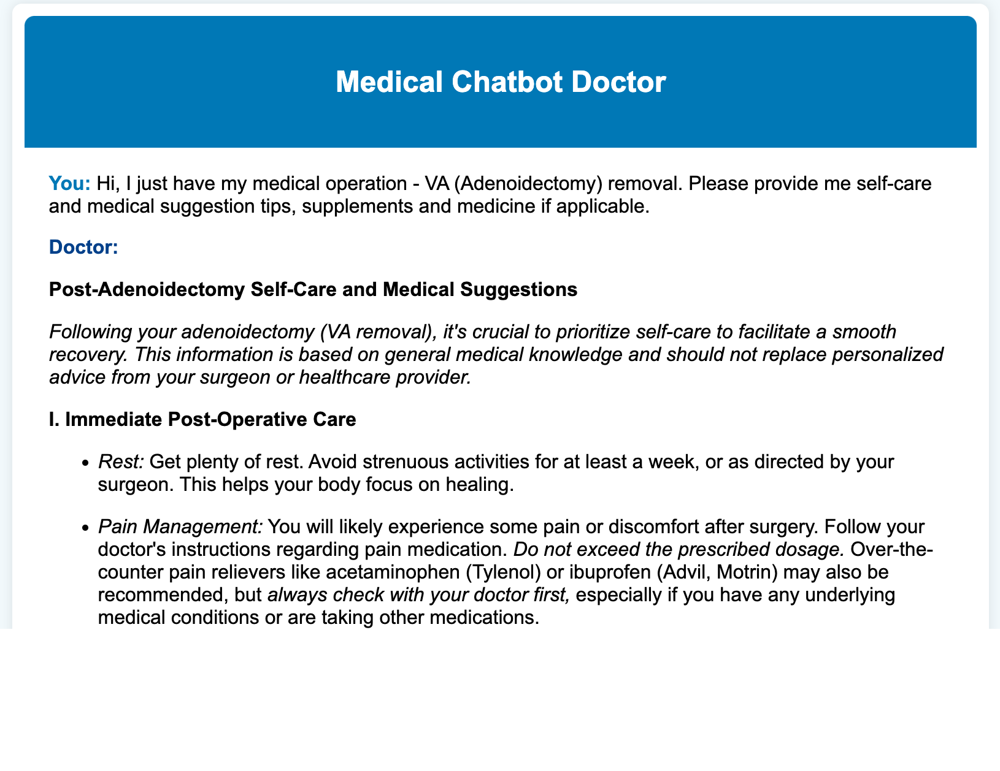
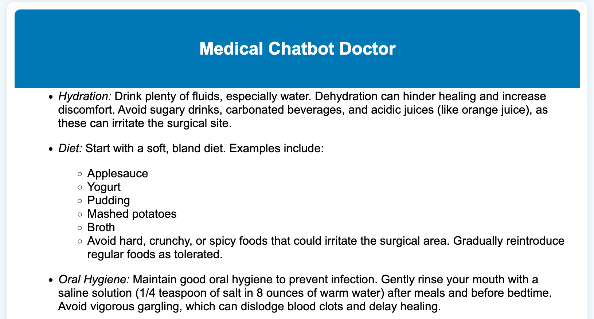
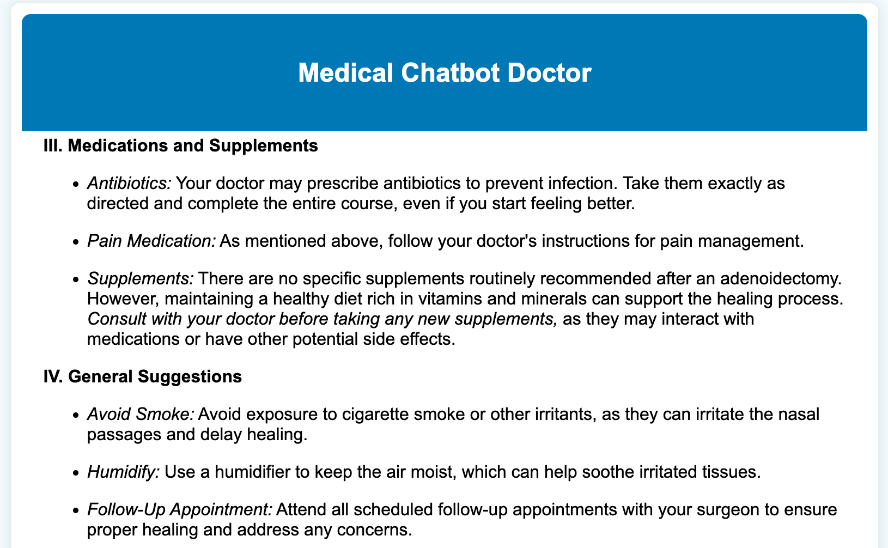
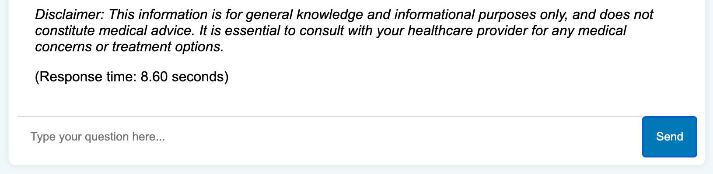

## **AutoGen-Based Medical Chatbot with RAG**

This project is about **Medical Chatbot** using **AutoGen**, **RAG (Retrieval-Augmented Generation)**, and **OpenAI API** with a **custom Hugging Face medical dataset**.

## Clone this repository:

```bash
git clone https://github.com/Lelekhoa1812/AutoGen-RAG-Medical-Chatbot.git
```

## Installation:
Visit [Setup](https://github.com/Lelekhoa1812/AutoGen-RAG-Medical-Chatbot/blob/main/setup.md) guidelines for instruction to install the project.  

## Autogen:
Find more practical usage ideas with [Autogen](https://github.com/Lelekhoa1812/AutoGen-RAG-Medical-Chatbot/blob/main/autogen.md).  

## Run:
```bash
python3 main.py
```

## Debug:
```bash
python3 -X faulthandler main.py
```

## Connect and list out collection from MongoDB
```bash
python3 connect_mongo.py
```

## Clear MongoDB data for data reset:
```bash
python3 clear_mongo.py
```

## MongoDB data migration
```bash
python3 migrate.py
```

## Example:
 

## Current UI:
 
 
 
 
 

## UI in progress:
 
