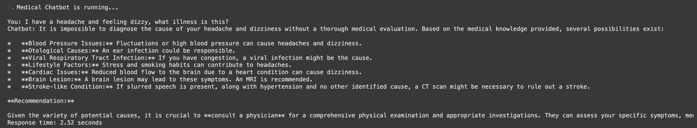
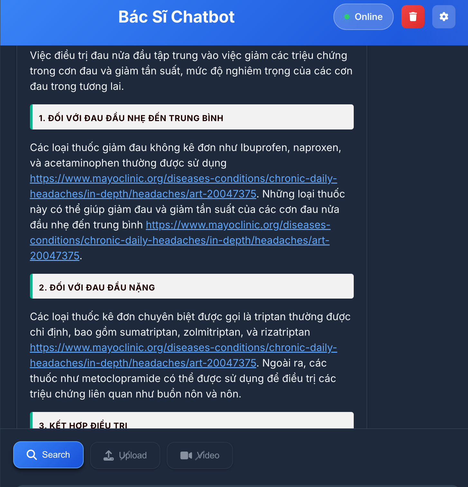
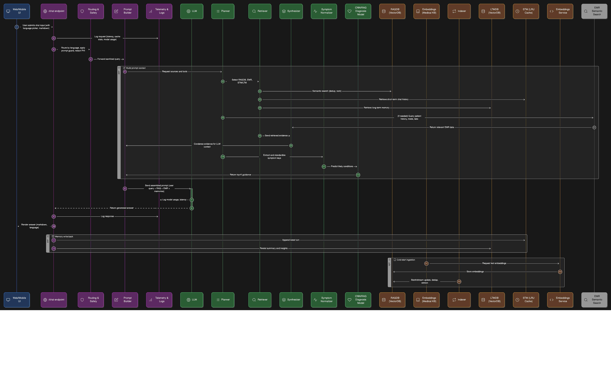

# Medical Chatbot Platform

Welcome to the RAG-based Medical Chatbot project! This project leverages Retrieval-Augmented Generation (RAG), Azure AI Foundry-hosted GPT models for reasoning and lightweight orchestration, medical imaging support, FAISS, and a curated medical knowledge base to deliver an intelligent medical chatbot. It uses a custom medical dataset (over 256,916 QA curation), diagnosis retrieval agent (over 4,962 symptom scenarios), and FAISS for efficient similarity search. The server runs on FastAPI and dynamically renders HTML using MarkdownJS.

## Access Now
- [Web App](https://medical-chatbot-henna.vercel.app/)
- [HF Space](https://huggingface.co/spaces/BinKhoaLe1812/Medical-Chatbot)

2. **Frontend**:  
   “Frontend (UI), built with Node.js and incorporating Vite, Axios, is deployed on Vercel.”

### Environment
Configure Azure AI access through environment variables:

```env
FOUNDRY_API_KEY=your_azure_ai_key
FOUNDRY_ENDPOINT=https://your-resource.openai.azure.com
LLM_MODEL=gpt-5.4
SLM_MODEL=gpt-5-nano
```

- `FOUNDRY_API_KEY`: Azure AI Foundry / Azure OpenAI API key
- `FOUNDRY_ENDPOINT`: Azure AI Foundry-compatible endpoint base
- `LLM_MODEL`: default stronger model for harder tasks
- `SLM_MODEL`: lightweight model for easier tasks, reranking, validation, guardrails, and query translation

### Frontend Capabilities
- Multilingual UX (EN/VI/ZH), light/dark themes, responsive design
- Two modes: Chat and Search (web‑augmented answers)
- Inline markdown, tables, lists; image upload and preview for medical imaging
- Source transparency: clickable magnifier icons linking to cited sources
- Polished UX with notifications, accessibility, and mobile-first layout

### Backend Capabilities
- RAG over curated medical KB (FAISS) with deduplication and decay scoring
- Query‑Focused Web Search Agent:
  - Aggregates up to 10 results via DuckDuckGo and expands select same‑domain links
  - Crawls large pages, chunks with overlap, and uses Azure AI LLMs to extract only query‑relevant facts per chunk
  - Merges distilled snippets per source and builds URL mappings for citations
- Summarization Everywhere (Azure AI):
  - Conversation/context compression, response chunking, and document synthesis
  - Text cleaning and key‑phrase priming to minimize token footprint
- Multilingual Query Translation (Azure AI SLM):
  - Vietnamese and Chinese queries are translated to English at runtime using the Foundry-hosted lightweight model
  - No local Hugging Face translation models are required for these language paths
- Vision (VLM) Pipeline: medical image description and analysis
- Safety Guardrails: Azure AI lightweight model validates user input and model output
- Citations: `<#ID>` tagging in model output → resolved to `<URL>` server‑side → rendered as source icons in UI

## 🧠 Technical Highlights
- FastAPI modular services (api, models, memory, search, utils)
- FAISS vector retrieval; MongoDB for KB and index artifacts
- Azure AI Foundry-hosted GPT models for keyword generation, summarization, reranking, safety classification, and translation
- Robust logging, retries, and graceful degradation in network‑bound paths

## 📸 Screenshots

### Chatbot Console Example


### Chatbot with Answer



## 📊 Memory & Retrieval
- Per‑user LRU short‑term memory with FAISS; up to 30 recent chunks
- Topic‑level chunking and summarization (Azure AI) for compact context
- Time‑decay and usage signals to prioritize what matters now

### 🧠 Knowledge Embedding & Diagnosis Retrieval
- SentenceTransformer embeddings for queries and KB entries (`all‑MiniLM‑L6‑v2`)
- Symptom diagnosis agent leveraging structured prognosis data
- MongoDB vector cache and FAISS for fast similarity search

## 🛡️ Trust & Safety
- Azure AI lightweight guard validation checks user requests and assistant responses
- Unsafe requests are blocked; unsafe responses are redacted with safe fallback
- Web‑derived claims carry explicit citations for auditability

## 🔗 Deployment

|  **Component** | **Hosting**           | **URL**                                           |
|----------------|-----------------------|---------------------------------------------------|
| Backend        | Hugging Face Spaces   | `https://binkhoale1812-medical-chatbot.hf.space/` |
| Frontend       | Vercel                | `https://medical-chatbot.vercel.app`              |
| Database       | MongoDB Atlas         | 2 DBs                                             |


## 🧩 Flowchart


## 📝 License
This project is licensed under the [Apache 2.0 License](LICENSE).

---
Author: (Liam) Dang Khoa Le
Latest Update: 08/10/2025
